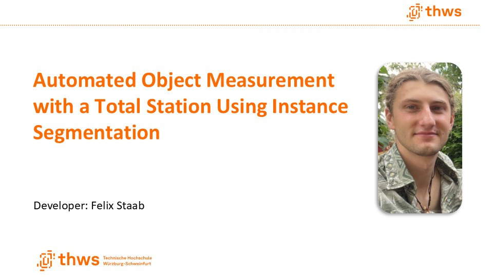
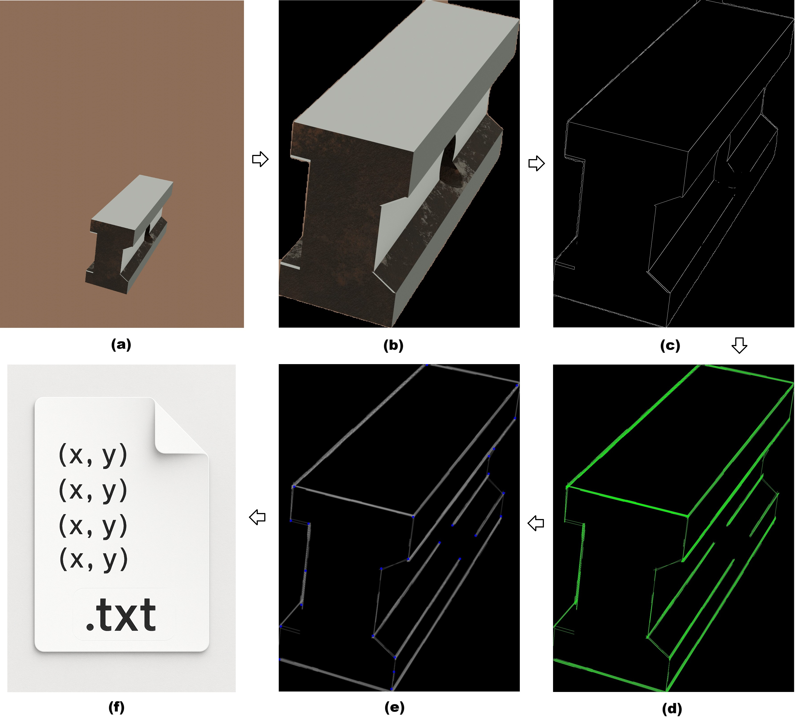

# Automated Object Measurement with a Total Station Using Instance Segmentation
*(Geodata Technology M.Eng. Thesis Project — THWS, 2025)*

[](https://www.youtube.com/watch?v=xHrBriSdfJM)

---

## Overview

This repository contains the public version of the software prototype developed during my master's thesis in **Geodata Technology (M.Eng.) at Technische Hochschule Würzburg-Schweinfurt (THWS), 2025**.

The project evaluates whether a **Computer Vision (CV) pipeline** can support **automated object measurement with a total station**.
It combines:

* **YOLOv8 (Large) instance segmentation**
* **Canny edge detection**
* **Progressive probabilistic Hough line Transform**
* **Harris Corner Detection**
* **DBSCAN clustering**
* **GeoCOM-based device control** of a Leica MS50 (all GeoCOM commands removed in this public version)

⚠️ **Important:**
The original measurement hardware, the trained YOLO model, and the physical object used for testing **are unique and not included**.
Images from other scenes cannot be segmented without retraining a model.

---

## Workflow Overview

The pipeline consists of six main CV steps (a–f) and an optional measurement step:



**(a)** Example image after acquisition (e.g., from the total station).
**(b)** Preprocessed image patch after segmentation, cropping, and masking.
**(c)** Result of the Canny edge detection showing fragmented edge traces.
**(d)** Detected line structures obtained using the Hough Transform.
**(e)** Identified object corner points using Harris Corner Detection, grouped via DBSCAN clustering.
**(f)** Placeholder icon representing the TXT file in which the corner-point pixel coordinates are stored.
**(Optional)** Total station control with the pipeline result via GeoCOM (GeoCOM commands not included in this repository, only schematic flowchart)

---

## Scripts and Their Role in the Workflow

### **1. [`Object_Segmentation_and_Canny_Edge_Detection_App.py`](segmentation_and_canny/Object_Segmentation_and_Canny_Edge_Detection_App.py) (Steps a–c)**

* Runs YOLOv8 instance segmentation
* Crops the detected object (in this workflow the used steel beam)
* Opens an interactive Canny GUI with manual + automatic methods
* Saves cropped object and edges

### **2. [`Hough_Line_Transform_App.py`](hough_transform/Hough_Line_Transform_App.py) (Step d)**

* Interactive GUI for the Progressive probabilistic Hough Transform
* Tunable parameters + live preview of detected lines
* Saves a line-only image on black background

### **3. [`Harris_Corner_detection_and_DBSCAN_Clustering_App.py`](harris_corner_detection/Harris_Corner_detection_and_DBSCAN_Clustering_App.py) (Step e)**

* Harris Corner Detection + DBSCAN clustering
* Tunable parameters + live preview of detected corner clusters
* Saves: visual output and list of final cluster centers (clustered object corners)

### **4. [`main_total_station_control.py`](total_station_control/main_total_station_control.py)**


* Central script intended to **control a total station** during the automated measurement workflow
* Sequentially triggers all three CV modules (segmentation → Hough → Harris) and integrates their outputs into the measurement loop
* **All GeoCOM commands removed**; placeholders indicate where users must insert their own device-specific total-station control
* Preserves the original architecture so the full pipeline can be rebuilt on Leica instruments or adapted to other manufacturers

---

## Repository Structure

```text
project/
│
├── README.md
├── requirements.txt
│
├── assets/
│   ├── computer_vision_pipeline.jpg
│   └── total_station_workflow_.jpg
│
├── segmentation_and_canny/
│   └── Object_Segmentation_and_Canny_Edge_Detection_App.py        # (a)-(c) YOLOv8 (Large) segmentation + Canny
│
├── hough_transform/
│   └── Hough_Line_Transform_App.py                                # (d) Progressive probabilistic Hough Transform
│
├── harris_corner_detection/
│   └── Harris_Corner_detection_and_DBSCAN_Clustering_App.py       # (e) Harris Corner Detection + DBSCAN corner clustering
│
└── total_station_control/
    └── main_total_station_control.py                              # (d) Structure for total-station workflow (GeoCOM removed)
```

---

## Requirements

Install dependencies:

```bash
pip install -r requirements.txt
```

---

## License

This project is licensed under the MIT License – see the [LICENSE](LICENSE) file for details.

---
